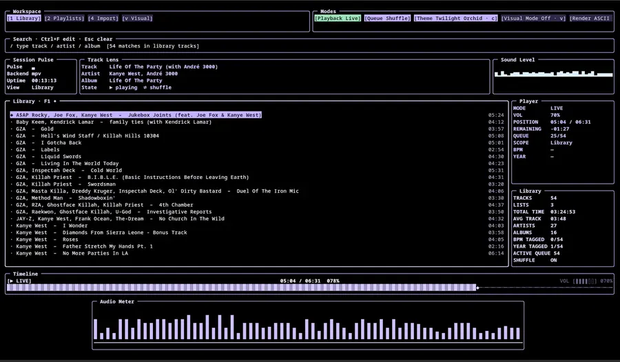
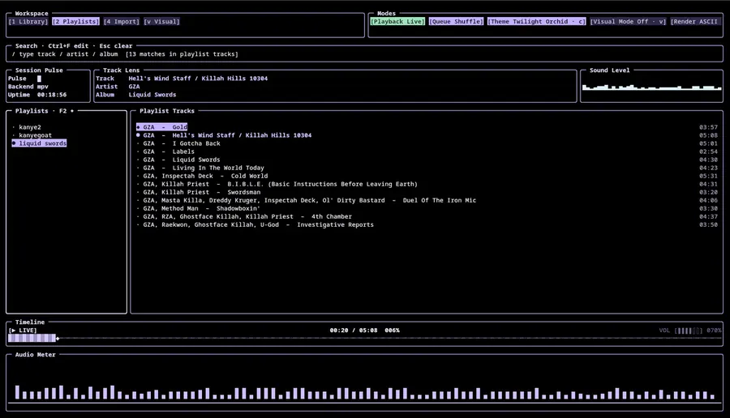
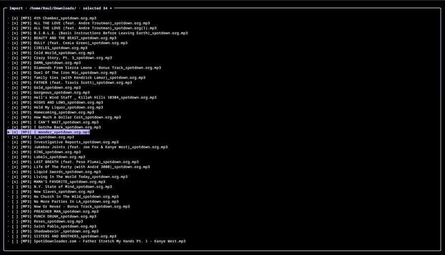

# VibeVault

Terminal music library player written in C# using Tessera UI framework.

Listen to local MP3s in a fast keyboard-first TUI with playlists, search, timeline seeking, loudness meter, manual queue ordering, and a high-quality album-art visual mode.

## What's New

- Manual playback queue:
  enqueue tracks with `q` and play them in chosen order with `n` (queue is consumed first).
- Queue on startup:
  manual queue is cleared when the app starts.
- Multi-select in Library:
  `Shift+Up/Down` range-select and `Ctrl+Space` toggle-select, then bulk add with `a` or bulk queue with `q`.
- Visualizer quality upgrade:
  improved ASCII/detail mapping, higher-quality sampling, and better visual layout balance.
- UI consistency:
  timeline/audio meter panel sizing is now consistent across Library and Playlists views.

## Supported Format

VibeVault currently imports and indexes MP3 files only.

| Capability | MP3 |
|------------|-----|
| Import from browser | Yes |
| Playback | Yes |
| Metadata read (title/artist/album/year/bpm) | Yes |
| Embedded cover art visual mode | Yes (if cover exists) |

## Installation

### Requirements

| Dependency | Required | Purpose |
|------------|----------|---------|
| .NET SDK 10.0+ | Yes | Build and run app |
| Docker (optional) | No | Reproducible release builds without local .NET install |
| Tessera | Yes | TUI framework |
| Microsoft.Data.Sqlite | Yes | Persistent library/playlists |
| TagLibSharp | Yes | MP3 metadata parsing |
| `ffplay` / `mpv` / `mpg123` / `vlc` | Yes | Audio backend (auto-detected) |
| `ffmpeg` or `avconv` | Optional | Loudness analysis and embedded cover extraction |

### Cross-Platform Targets

| OS | Architectures |
|----|---------------|
| Linux | `x64`, `arm64` |
| macOS | `x64`, `arm64` |
| Windows | `x64`, `arm64` |

Check out Tessera: https://georgetsouvaltzis.github.io/tessera/

### Install (Terminal, Recommended)

#### Linux / macOS

```bash
curl -fsSL https://raw.githubusercontent.com/raula09/VibeVault/main/install.sh | bash
```

#### Windows (PowerShell)

```powershell
iwr -useb https://raw.githubusercontent.com/raula09/VibeVault/main/install.ps1 | iex
```

### Windows Terminal Rendering

VibeVault now auto-falls back to ASCII UI glyphs on legacy Windows console hosts. Unicode glyphs stay enabled in modern terminals (Windows Terminal, VS Code terminal, WezTerm, and other xterm-like hosts).

- Force ASCII mode: `setx VIBEVAULT_ASCII 1`
- Force Unicode mode: `setx VIBEVAULT_UNICODE 1`

### Build Release Artifacts (All Platforms)

```bash
chmod +x scripts/publish-all.sh
./scripts/publish-all.sh v1.0.0
```

Artifacts are written to `dist/<version>/<rid>/`.

### Build Release Artifacts With Docker

Use this if you want reproducible publish output from a clean containerized toolchain.

```bash
chmod +x scripts/publish-all-docker.sh
./scripts/publish-all-docker.sh v1.0.0
```

Artifacts are written to `dist/<version>/<rid>/`.

Docker is best for building and packaging. For running VibeVault itself (TUI + host audio backends), native install is usually better than running inside a container.

### Run From Source

```bash
dotnet restore
dotnet run
```


## Keybindings

### Global

| Key | Action |
|-----|--------|
| `F1` / `1` | Library view |
| `F2` / `2` | Playlists view |
| `F4` / `4` | Import browser |
| `v` | Toggle cover visual mode |
| `i` | Toggle visual render (`ASCII` / `IMAGE`) in visual mode |
| `Space` | Play/Pause |
| `n` / `p` | Next/Previous track (`n` consumes manual queue first) |
| `q` | Queue selected/focused track(s) in current view |
| `s` | Shuffle on/off |
| `+` / `-` | Volume up/down |
| `c` | Cycle UI palette |
| `?` | Show/hide controls panel |
| `Ctrl+C` | Quit |

### Library View

| Key | Action |
|-----|--------|
| `j` / `k` or `↓` / `↑` | Move selection |
| `Shift+Up/Down` | Range-select tracks |
| `Ctrl+Space` | Toggle focused track in selection |
| `Enter` | Play selected track |
| `q` | Queue selected track(s) in order |
| `a` | Add selected track(s) to playlist |
| `d` / `Delete` | Remove selected track from library |
| `Ctrl+F` | Start search |
| `Esc` | Clear search |

### Playlists View

| Key | Action |
|-----|--------|
| `j` / `k` | Move playlist selection |
| `Tab` / `l` / `h` | Switch focus between playlists and tracks |
| `Enter` | Open playlist / play focused track |
| `q` | Queue focused playlist track |
| `n` | If queue has items: play next queued track; otherwise create new playlist |
| `r` | Remove selected track from active playlist |
| `D` | Delete active playlist |
| `Ctrl+F` | Search playlist tracks |

### Import Browser

| Key | Action |
|-----|--------|
| `j` / `k` or `↓` / `↑` | Move cursor |
| `Enter` | Open folder or import file |
| `Backspace` | Go up directory |
| `Space` | Single-select file |
| `Ctrl+Space` | Toggle marked file |
| `Shift+Up/Down` | Range-select files |
| `g` | Paste a shared Google Drive folder link and import MP3s |
| `Esc` | Exit import browser |

## Backends

Terminal installer bootstraps one supported audio backend (`ffplay`, `mpv`, `mpg123`, or `vlc`) when none are available, then VibeVault auto-detects what is installed.

## Files

Configuration and data are stored in the VibeVault app-data directory.

| System | Base Path |
|--------|-----------|
| Linux | `~/.config/VibeVault/` |
| macOS | `~/Library/Application Support/VibeVault/` |
| Windows | `%APPDATA%\\VibeVault\\` |

| File | Description |
|------|-------------|
| `library.db` | SQLite library + playlists |
| `ui-settings.json` | Theme index, controls-panel visibility, visual render mode |

## Screenshots

### Library



### Playlist + Track Panels



### Album Art Visualizer



## License

No license file is currently included in this repository.
